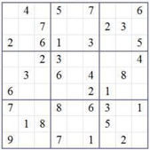

## PHP Sudoku Test

The classical Sudoku is a game, where the player needs to fill the gaps in a matrix of numbers (left image) in a way that three constraints are met:
Every number between 1 and 9 can only be present exactly once in each of the

 * nine rows
 * nine columns
 * nine 3x3 boxes

Example of an unsolved game:

Example of a solved game:

### Task

Please write modern standard PHP code that checks if the completed Sudoku (right picture) is solved correctly. Think of a good data structure and keep track of the time used.
When sending your solution, please describe the thought process of your solution and openly share how long it took you. Imagine we were working together and you were expected to solve this task in the time you stated, so be honest ;-)

[Mubashar Ali]: Well, I had seen this game but I never play with full interest :) So, I decided to first rules of this game and then I came to know the rules are:
	- Each row, column and group should have unique values from 1-9.
	- No duplication of any number.
	
Based on the rules, the things came into my mind was to check 'uniqueness' and there 'shouldn't be a repetition' of any number in row, column and box. So, I did some dry run on few dataset before start the actual develpoment.

It took approximately 3 hours to finish this task which including analysis, planning, coding and testing.  
